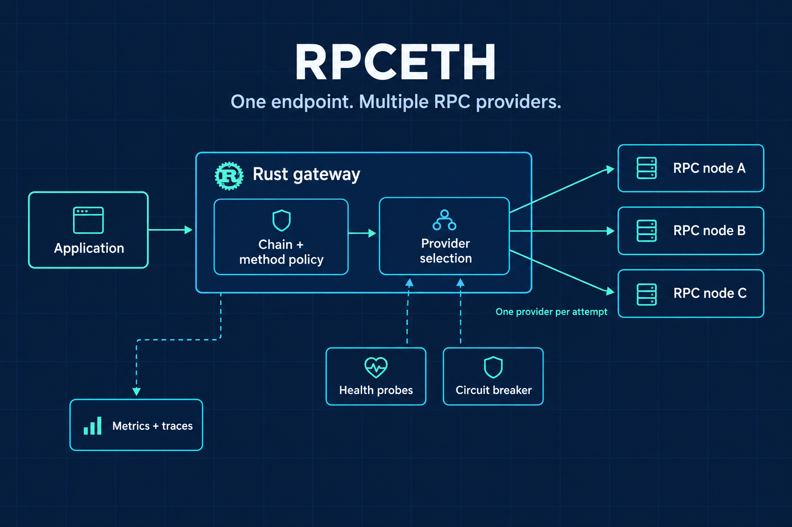
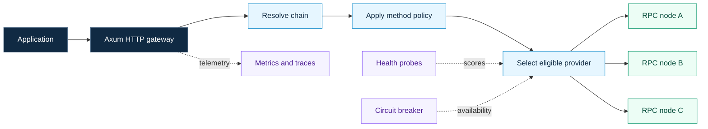

<div align="center">

# RPCETH

**One endpoint. Multiple Ethereum RPC providers.**

A Rust JSON-RPC gateway with health-aware routing, provider failover, and visibility into each request.

[Quick start](#quick-start) · [Architecture](docs/architecture.md) · [Configuration](#configuration) · [API](#api) · [Development](#development)

</div>



---

RPCETH sits between your application and its upstream RPC nodes. It selects a provider for each request, applies chain and method policies, and tries another provider when an attempt fails. The core library is separate from the Axum HTTP server, so routing and provider management can also be used from Rust.

| Capability | What is in the code |
| --- | --- |
| Provider selection | Weighted random or round-robin selection, with health scores and method policy inputs |
| Multiple chains | Separate provider pools, named chains, aliases, and a default chain |
| Method policies | Glob-based overrides, read/write groups, timeouts, weights, and attempt limits |
| Failure handling | Provider exclusion between attempts, optional exponential backoff, and circuit breakers |
| Observability | Prometheus metrics, OpenTelemetry export, structured logs, and admin endpoints |

## Request flow

<details>
<summary>View the editable request-flow diagram</summary>



</details>

The arrows to nodes show possible destinations; a normal request selects one provider per attempt. See the [architecture notes](docs/architecture.md) for retry behavior and implementation boundaries.

## Quick start

Use a Rust toolchain that supports Edition 2024. Docker Compose is optional for the included monitoring stack.

```sh
git clone https://github.com/umgbhalla/rpceth.git
cd rpceth
```

Edit [`config/proxy.yaml`](config/proxy.yaml): set `auth.api_key`, replace the example upstream URLs with nodes you operate or are authorized to use, and select the chains you need. The checked-in provider list is an example, not a guarantee that those endpoints remain available.

For local monitoring, start the collector and dashboards before the proxy:

```sh
docker compose -f docker/docker-compose.yaml up -d
```

Run the server from the repository root. `-j 2` limits Cargo's build parallelism.

```sh
RUST_LOG=info cargo run -j 2 -p proxy-server
```

The binary reads `config/proxy.yaml`, listens on `0.0.0.0:3000`, and exports OTLP telemetry to `http://localhost:4317`. Those locations are currently set in [`main.rs`](crates/proxy-server/src/main.rs).

Send a request using the API key you configured:

```sh
curl --request POST 'http://localhost:3000/ethereum?apikey=YOUR_API_KEY' \
  --header 'Content-Type: application/json' \
  --data '{"jsonrpc":"2.0","id":1,"method":"eth_blockNumber","params":[]}'
```

Stop the monitoring stack with `docker compose -f docker/docker-compose.yaml down`.

## Configuration

This minimal example routes Ethereum traffic between two local upstream nodes. Replace `config/proxy.yaml` with it only if those nodes are available on your machine.

```yaml
strategy: weighted_random
auth:
  api_key: replace-with-your-own-key
providers:
  - id: primary
    url: http://127.0.0.1:8545
    base_weight: 700
    timeout_ms: 3000
  - id: secondary
    url: http://127.0.0.1:8546
    base_weight: 300
    timeout_ms: 3000
chains:
  ethereum:
    providers: [primary, secondary]
    aliases: ["eth", "1"]
default_chain: ethereum
```

Weights express selection preferences, not guaranteed traffic percentages. Health and method policies also affect selection.

| Setting | Behavior |
| --- | --- |
| `strategy` | `weighted_random` or `round_robin` |
| `chains` | Maps chain names to provider IDs and aliases |
| `default_chain` | Selects the pool used by `POST /` |
| `methods.groups` / `methods.overrides` | Applies policies to method groups and glob patterns |
| `default_tolerance` | `Strict`, `Balanced`, or `Relaxed` |
| `max_retries` | Currently used as the total attempt limit, with at least one attempt |
| `circuit_breaker` | Configures failure threshold, reset interval, and half-open probes |

See the [full example](config/proxy.yaml), [Chainlist example](config/proxy-chainlist-example.yaml), and [configuration types](crates/proxy-core/src/config.rs) for more options. Restart the process after configuration changes; hot reload is not implemented.

## API

| Method | Path | Purpose |
| --- | --- | --- |
| `POST` | `/?apikey=...` | Forward through the default chain |
| `POST` | `/{chain_id}?apikey=...` | Forward through a named chain or alias |
| `GET` | `/healthz` | Process liveness |
| `GET` | `/readyz` | Readiness based on provider circuit availability |
| `GET` | `/admin/providers` | Provider status and health details |
| `GET` | `/admin/config` | Configuration summary |
| `GET` | `/metrics` | Prometheus metrics |

RPC requests can include `provider_id` in the query string to select a particular provider in the chain. Authentication currently uses the `apikey` query parameter. Admin and metrics routes are outside that authentication middleware; keep them on a trusted network or protect them at your ingress. Query strings and provider URLs can appear in logs, so configure log redaction when using credentials.

## Observability

The [Compose stack](docker/docker-compose.yaml) includes an OpenTelemetry Collector, Prometheus, Grafana, and Jaeger. It provides local development defaults, including Grafana's `admin` / `admin` login.

| Service | Local address |
| --- | --- |
| Proxy | `http://localhost:3000` |
| Grafana | `http://localhost:3001` |
| Prometheus | `http://localhost:9090` |
| Jaeger | `http://localhost:16686` |
| OTLP gRPC collector | `http://localhost:4317` |

Dashboards live in [`docker/grafana/dashboards/`](docker/grafana/dashboards/). The Prometheus configuration uses `host.docker.internal` to reach the host process; adapt that target for other Docker network setups.

## Development

```sh
# Inspect the workspace without compiling dependencies.
cargo metadata --no-deps --format-version 1

# Run the core library's integration tests with limited build parallelism.
cargo test -j 2 -p proxy-core --tests
```

Core tests cover configuration, method routing, health scoring, and provider selection. Python scripts in [`smoke_tests/`](smoke_tests/) exercise a running proxy and can contact upstream services; review their configuration before running them.

```text
crates/
  proxy-core/       Configuration, routing, health, circuit breakers
  proxy-server/     Axum gateway, admin endpoints, telemetry
config/            Provider and chain configuration examples
docker/            Local observability stack and dashboards
docs/              Architecture and operational details
smoke_tests/       Python checks against a running proxy
```

## Documentation

- [Architecture and current boundaries](docs/architecture.md)
- [Credential handling and security checks](SECURITY.md)
- [Core library reference](CORE_LIBRARY_DOCS.md)
- [Recorded RPC method checks](RPC_METHODS_TESTED.md)
- [Recorded chain ID checks](smoke_tests/README_CHAINID_TESTS.md)

The recorded checks describe earlier work; they are not a current CI or live-service status report. This repository does not currently include a checked-in CI workflow.
