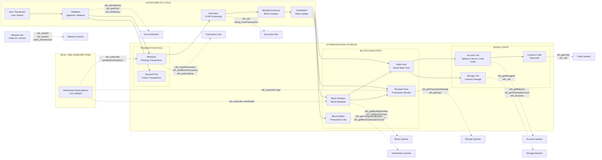
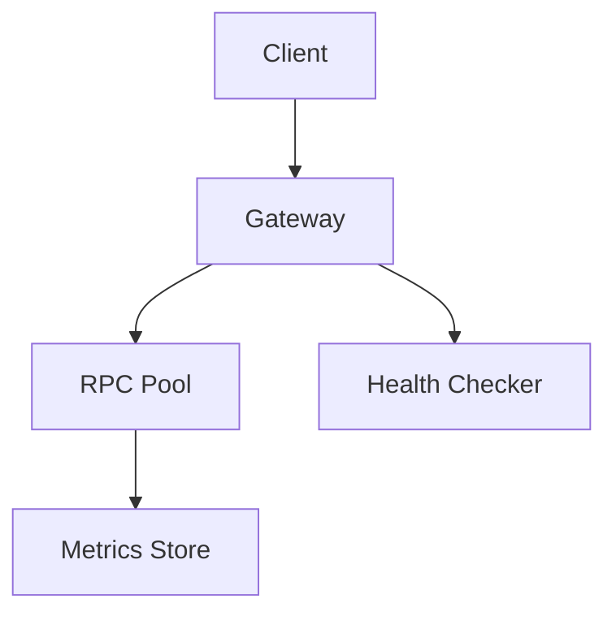

# ethereum rpc load balancer gateway - design document

## overview

weighted priority rpc method load balancer gateway system for ethereum mainnet rpc endpoints. handles health tracking, failure detection, and intelligent request routing across multiple rpc providers in rust.

## architecture

### core components



### system layers

1. **http server layer** - hyper-based async http server
2. **routing layer** - weighted load balancer with method awareness
3. **provider pool** - manages multiple ethereum rpc endpoints
4. **health monitoring** - continuous health checks and failure tracking
5. **metrics layer** - prometheus metrics and observability

## provider health model

### health metrics tracked

- **block height sync** - compare against reference providers
- **response latency** - p50, p95, p99 response times
- **success rate** - rolling window success percentage
- **method availability** - specific rpc method support
- **connection stability** - websocket/http connection health

### health check methods

```rust
// primary health indicators
eth_blockNumber    // sync status
eth_chainId        // network connectivity
eth_syncing        // node sync state
net_version        // network compatibility

// method-specific checks
eth_getBalance     // state queries
eth_call           // contract calls
eth_sendRawTransaction // transaction submission

```

### health scoring algorithm

```
health_score = (
  sync_score * 0.4 +        // most critical
  latency_score * 0.3 +     // performance
  success_rate * 0.2 +      // reliability
  method_support * 0.1      // capability
)

where each component is 0.0-1.0

```

## weighted load balancing

## custom input weight system

load balancing combines **user-defined weights** with **dynamic health adjustments**:

**base provider weights** (user configurable):

- static weight values set via configuration (0-1000 scale)
- represents business logic, cost preferences, or strategic priorities
- examples: premium provider = 800, backup provider = 200

**tolerance level configuration** (per method/global):

- **strict** (tolerance: 0.1) - only use providers within 10% of best health score
- **balanced** (tolerance: 0.3) - use providers within 30% of best health score
- **relaxed** (tolerance: 0.5) - use providers within 50% of best health score

### final weight calculation

```rust
final_weight = base_weight * health_multiplier * tolerance_filter

where:
health_multiplier = current_health_score (0.0-1.0)
tolerance_filter = 1.0 if within tolerance, 0.0 if outside

```

**method-specific weight customization**:
different rpc methods can override global weights:

**read-heavy methods** (custom weight preferences):

- eth_call, eth_getBalance, eth_getStorageAt
- can prioritize low-latency providers with higher custom weights

**write methods** (custom reliability priorities) → broadcast:

- eth_sendRawTransaction, eth_sendTransaction
- can prioritize trusted providers with higher custom weights

**block/transaction queries** (custom sync priorities):

- eth_getBlockByNumber, eth_getTransactionByHash
- can prioritize well-synced providers with higher custom weights

### dynamic weight adjustment with custom base

weights adjust based on custom input + dynamic factors:

- **base custom weight** × **rolling 5-minute success rate**
- **tolerance filtering** - exclude providers outside tolerance threshold
- **exponential backoff** for failed providers (temporarily weight = 0)
- **gradual recovery** for recovering providers (slowly restore custom weight)

## failure handling

### failure detection triggers

- **hard failures**: connection timeout, http 5xx, json-rpc errors
- **soft failures**: high latency (>2s), stale blocks (>3 behind), low success rate (<95%)
- **method failures**: specific rpc method returning errors consistently

### failure response strategies

1. **immediate failover** - route to next healthy provider
2. **circuit breaker** - temporarily disable failing providers
3. **retry logic** - exponential backoff with jitter
4. **graceful degradation** - fallback to read-only providers for writes

### recovery mechanisms

- **health probe interval**: 30s for failed, 10s for degraded, 60s for healthy
- **recovery threshold**: 3 consecutive successful health checks
- **gradual traffic increase**: 10% -> 50% -> 100% traffic restoration

## configuration model

### provider configuration

```yaml
# global tolerance settings
global_config:
  default_tolerance: "balanced"  # strict/balanced/relaxed
  tolerance_levels:
    strict: 0.1      # within 10% of best health
    balanced: 0.3    # within 30% of best health
    relaxed: 0.5     # within 50% of best health

providers:
  - name: "alchemy-mainnet"
    url: "https://eth-mainnet.g.alchemy.com/v2/key"
    base_weight: 800     # custom input weight (0-1000)
    timeout: 30s
    max_connections: 50
    methods: ["all"]

  - name: "infura-mainnet"
    url: "https://mainnet.infura.io/v3/key"
    base_weight: 600     # custom input weight
    timeout: 45s
    max_connections: 30
    methods: ["read_only"]

  - name: "quicknode-backup"
    url: "https://api.quicknode.com/..."
    base_weight: 200     # lower priority backup
    timeout: 60s
    max_connections: 20
    methods: ["all"]

```

### method routing rules with custom weights

```yaml
routing_rules:
  eth_call:
    tolerance: "strict"           # only best performing providers
    max_retries: 2
    timeout: 10s
    provider_weight_overrides:    # optional custom weights per method
      alchemy-mainnet: 900        # prefer alchemy for calls
      infura-mainnet: 700

  eth_sendRawTransaction:
    tolerance: "balanced"         # allow more provider options
    max_retries: 3
    timeout: 30s
    require_sync: true
    provider_weight_overrides:
      alchemy-mainnet: 850        # high reliability priority
      quicknode-backup: 300       # backup gets higher weight for writes

  eth_getBlockByNumber:
    tolerance: "relaxed"          # use all available providers
    max_retries: 2
    timeout: 15s
    # uses global provider base_weights

```

## implementation details

### rust tech stack

- **hyper** - async http server
- **tokio** - async runtime
- **serde_json** - json-rpc parsing
- **reqwest** - http client for upstream requests
- **prometheus** - metrics collection
- **tracing** - structured logging
- **config** - yaml configuration loading

### key data structures

```rust
#[derive(Debug, Clone)]
pub struct RpcProvider {
    pub id: String,
    pub url: Url,
    pub base_weight: u32,           // user-defined custom weight (0-1000)
    pub current_weight: f64,        // calculated final weight
    pub health: HealthMetrics,
    pub client: reqwest::Client,
    pub supported_methods: HashSet<String>,
}

#[derive(Debug, Clone)]
pub struct HealthMetrics {
    pub block_height: u64,
    pub last_check: Instant,
    pub success_rate: f64,
    pub avg_latency: Duration,
    pub health_score: f64,          // normalized 0.0-1.0 health score
    pub is_syncing: bool,
    pub consecutive_failures: u32,
}

#[derive(Debug)]
pub struct LoadBalancer {
    providers: Vec<RpcProvider>,
    global_tolerance: ToleranceLevel,
    method_configs: HashMap<String, MethodConfig>,
    circuit_breakers: HashMap<String, CircuitBreaker>,
}

#[derive(Debug, Clone)]
pub struct MethodConfig {
    pub tolerance: Option<ToleranceLevel>,  // override global tolerance
    pub weight_overrides: HashMap<String, u32>, // provider-specific weights
    pub max_retries: u32,
    pub timeout: Duration,
    pub require_sync: bool,
}

#[derive(Debug, Clone, Copy)]
pub enum ToleranceLevel {
    Strict(f64),    // 0.1 = within 10% of best
    Balanced(f64),  // 0.3 = within 30% of best
    Relaxed(f64),   // 0.5 = within 50% of best
}

```

### request flow

1. **parse json-rpc request** - extract method and params
2. **determine tolerance level** - use method-specific or global tolerance
3. **filter eligible providers** - exclude providers outside tolerance threshold
4. **calculate final weights** - custom_weight × health_score × method_overrides
5. **weighted selection** - probabilistic selection from eligible providers
6. **execute request** - forward to selected provider with timeout
7. **handle response** - process result, update metrics
8. **retry logic** - failover with different provider if within tolerance
9. **return response** - proxy response back to client

### provider selection algorithm

```rust
// example selection logic
fn select_provider(&self, method: &str) -> Option<&RpcProvider> {
    let config = self.method_configs.get(method);
    let tolerance = config.tolerance.unwrap_or(self.global_tolerance);

    // find best health score among all providers
    let best_health = self.providers.iter()
        .map(|p| p.health.health_score)
        .max_by(|a, b| a.partial_cmp(b).unwrap())?;

    // filter providers within tolerance threshold
    let eligible: Vec<&RpcProvider> = self.providers.iter()
        .filter(|p| {
            let health_ratio = p.health.health_score / best_health;
            match tolerance {
                ToleranceLevel::Strict(t) => health_ratio >= (1.0 - t),
                ToleranceLevel::Balanced(t) => health_ratio >= (1.0 - t),
                ToleranceLevel::Relaxed(t) => health_ratio >= (1.0 - t),
            }
        })
        .collect();

    // calculate final weights with custom base weights and overrides
    let weighted: Vec<(f64, &RpcProvider)> = eligible.iter()
        .map(|p| {
            let base = config.weight_overrides
                .get(&p.id)
                .copied()
                .unwrap_or(p.base_weight) as f64;
            let final_weight = base * p.health.health_score;
            (final_weight, *p)
        })
        .collect();

    // weighted random selection
    weighted_random_select(weighted)
}

```

### concurrency model

- **async/await throughout** - non-blocking io operations
- **connection pooling** - reuse http connections to providers
- **request batching** - support json-rpc batch requests
- **background health checks** - separate tokio tasks for monitoring

## monitoring and observability

### prometheus metrics

```
# request metrics
rpc_requests_total{method, provider, status}
rpc_request_duration_seconds{method, provider}
rpc_errors_total{method, provider, error_type}

# provider health metrics
provider_health_score{provider}
provider_block_height{provider}
provider_response_time{provider, percentile}

# system metrics
active_connections{provider}
circuit_breaker_state{provider}

```

### logging structure

```rust
tracing::info!(
    method = %request.method,
    provider = %selected_provider.id,
    latency_ms = %latency.as_millis(),
    "request completed"
);

```

## success metrics

### performance targets

- **p95 latency**: <500ms for read methods, <2s for write methods
- **availability**: 99.9% uptime with provider failures
- **throughput**: handle 1000+ rps per instance
- **failover time**: <100ms to detect and switch providers

### operational targets

- **false positive rate**: <1% for health check failures
- **recovery time**: <60s to restore traffic to recovered providers
- **zero-downtime**: config changes without service interruption

## deployment considerations

### scaling model

- **horizontal scaling** - multiple gateway instances behind load balancer
- **stateless design** - no shared state between instances
- **config reloading** - hot reload provider configurations
- **health state sharing** - optional redis for shared health state

### security considerations

- **rate limiting** - per-client request rate limits
- **api key management** - secure upstream provider keys
- **request validation** - json-rpc request sanitization
- **access logging** - comprehensive request audit trails

### operational features

- **graceful shutdown** - finish in-flight requests before shutdown
- **health endpoint** - /health endpoint for k8s liveness/readiness
- **admin api** - provider management and manual failover
- **configuration validation** - startup config validation

## future extensions

### phase 2 ideas

- **multi-chain support** - polygon, arbitrum, optimism routing
- **caching layer** - redis cache for read-heavy methods
- **method-specific timeouts** - different timeouts per rpc method
- **geographic routing** - provider selection based on client location

### phase 3 ideas (?)

- **websocket support** - persistent connections and subscriptions
- **request analytics** - method usage patterns and optimization
- **cost optimization** - provider cost tracking and routing
- **auto-scaling** - dynamic provider pool management

xrayid with opentelemetry trace info

hard/soft failure , try with rest on atmost 3 retires loop
